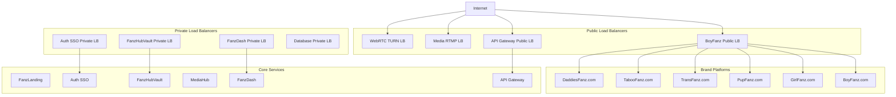

# FANZ DigitalOcean Load Balancers - Complete Setup Guide

## Overview

This guide provides complete setup and management instructions for DigitalOcean Load Balancers in the FANZ ecosystem. The configuration supports multiple brand platforms (BoyFanz, GirlFanz, PupFanz, TransFanz, TabooFanz, DaddiesFanz) along with core services (API Gateway, FanzDash, MediaHub, FanzHubVault, Auth SSO).

## Architecture Overview



## Directory Structure

```
k8s/
├── load-balancers/
│   ├── public/
│   │   ├── boyfanz-public-lb.yaml
│   │   └── api-gateway-public-lb.yaml
│   ├── private/
│   │   └── core-private-lb.yaml
│   └── media/
│       └── media-services-lb.yaml
├── ingress/
│   ├── brands/
│   │   └── fanz-brands-ingress.yaml
│   └── core/
│       └── fanz-core-ingress.yaml
└── services/
    ├── brands/
    └── core/
scripts/
└── deploy-fanz-load-balancers.sh
```

## Load Balancer Configuration

### Public Load Balancers

#### 1. BoyFanz Public Load Balancer
- **Purpose**: Handles external traffic for all brand platforms
- **Domains**: boyfanz.com, girlfanz.com, pupfanz.com, etc.
- **Features**:
  - TLS 1.3 termination
  - HTTP to HTTPS redirect
  - Adult content headers
  - Rate limiting (100 req/min per IP)
  - Proxy protocol for real client IPs
- **Size**: 3 nodes for high availability

#### 2. API Gateway Public Load Balancer  
- **Purpose**: Central API gateway for all platforms
- **Domain**: api.fanzunlimited.com
- **Features**:
  - Higher capacity (5 nodes)
  - Enhanced rate limiting (500 req/min)
  - Sticky sessions for API workflows
  - CORS support for cross-origin requests
- **Backend**: Kong API Gateway

### Private Load Balancers

#### 1. Auth SSO Private Load Balancer
- **Purpose**: Internal authentication service
- **Access**: VPC-only (10.0.0.0/8)
- **Features**:
  - Sticky sessions for auth flows
  - Enhanced health checks
  - High security headers
- **Backend**: Keycloak

#### 2. FanzHubVault Private Load Balancer
- **Purpose**: Regulatory forms and sensitive data storage
- **Domain**: vault.fanz.foundation
- **Access**: Restricted VPC only
- **Features**:
  - Maximum security configuration
  - Strict rate limiting (30 req/min)
  - All access logged
- **Backend**: HashiCorp Vault

#### 3. FanzDash Private Load Balancer
- **Purpose**: Security control center and admin dashboard
- **Domain**: dash.fanzunlimited.com
- **Access**: Admin IP whitelist
- **Features**:
  - WebSocket support
  - Session stickiness
  - Enhanced security headers
  - Audit logging

### Media Services Load Balancers

#### 1. RTMP Ingest Load Balancer
- **Purpose**: Live streaming ingestion
- **Port**: 1935 TCP
- **Access**: Global (for creators to stream)
- **Features**:
  - TCP load balancing
  - Client IP affinity
  - Health checks on RTMP service

#### 2. HLS Origin Load Balancer (Private)
- **Purpose**: Media origin for CDN
- **Access**: CDN and VPC only
- **Features**:
  - High capacity (5 nodes)
  - Large file support (no size limit)
  - Extended timeouts (20 minutes)
  - CDN IP whitelist

#### 3. WebRTC TURN Load Balancer
- **Purpose**: Real-time communication relay
- **Ports**: 3478 UDP/TCP, 5349 TCP
- **Access**: Global
- **Features**:
  - UDP/TCP dual protocol
  - Client IP affinity
  - Global access for WebRTC

## Domain Mappings

### Brand Domains (using approved domain list)
- **BoyFanz**: boyfanz.com → BoyFanz platform
- **GirlFanz**: girlfanz.com → GirlFanz platform  
- **PupFanz**: pupfanz.com → PupFanz platform
- **TransFanz**: transfanz.com → TransFanz platform
- **TabooFanz**: taboofanz.com → TabooFanz platform (replaces EbonyFanz)
- **DaddiesFanz**: daddiesfanz.com → DaddiesFanz platform

### Core Service Domains
- **FanzLanding**: fanzunlimited.com → Main portal
- **API Gateway**: api.fanzunlimited.com → API services
- **FanzDash**: dash.fanzunlimited.com → Admin dashboard (private)
- **MediaHub**: media.fanz.media → Media origin (CDN front)
- **FanzHubVault**: vault.fanz.foundation → Compliance vault (private)
- **Ad Service**: ads.fanz.fans → Advertisement platform
- **Auth SSO**: sso.fanz.fans → Authentication service

## Compliance and Security Features

### Adult Content Compliance
- **Age verification headers** on all brand platforms
- **Adult content warnings** in HTTP headers
- **Enhanced rate limiting** for sensitive content (TabooFanz)
- **Policy page links** to https://fanz.foundation/knowledge-base

### Security Configuration
- **TLS 1.3 only** with modern cipher suites
- **HSTS headers** with includeSubDomains
- **Content Security Policy** headers
- **X-Frame-Options** and XSS protection
- **Rate limiting** per IP and service type
- **Real client IP** preservation via proxy protocol

### Privacy and Regional Controls
- **GDPR compliance** headers and geo-routing
- **ADA/WCAG 2.2 AA** accessibility headers
- **VPC isolation** for sensitive services
- **IP whitelisting** for admin interfaces
- **Audit logging** for all admin and vault access

## Deployment Instructions

### Prerequisites
1. **kubectl** configured with DOKS cluster access
2. **DigitalOcean API token** (optional, for validation)
3. **Required certificates** uploaded to DigitalOcean
4. **DNS zones** configured (Cloudflare or DigitalOcean DNS)

### Quick Start
```bash
# Deploy all load balancers
./scripts/deploy-fanz-load-balancers.sh deploy-all

# Deploy with dry run first
./scripts/deploy-fanz-load-balancers.sh --dry-run deploy-all

# Deploy only public load balancers
./scripts/deploy-fanz-load-balancers.sh deploy-public

# Check status
./scripts/deploy-fanz-load-balancers.sh status
```

### Step-by-Step Deployment

1. **Validate Configuration**
   ```bash
   ./scripts/deploy-fanz-load-balancers.sh validate
   ```

2. **Deploy in Stages**
   ```bash
   # Deploy private services first
   ./scripts/deploy-fanz-load-balancers.sh deploy-private
   
   # Deploy media services
   ./scripts/deploy-fanz-load-balancers.sh deploy-media
   
   # Deploy public services
   ./scripts/deploy-fanz-load-balancers.sh deploy-public
   
   # Deploy ingress rules
   ./scripts/deploy-fanz-load-balancers.sh deploy-ingress
   ```

3. **Verify Deployment**
   ```bash
   # Check load balancer status
   kubectl get services --all-namespaces -o wide | grep LoadBalancer
   
   # Check ingress status
   kubectl get ingress --all-namespaces
   
   # Verify external IPs assigned
   ./scripts/deploy-fanz-load-balancers.sh status
   ```

## DNS Configuration

After load balancers are deployed and have external IPs:

1. **Update DNS Records**
   ```
   boyfanz.com          A    <boyfanz-public-lb-ip>
   girlfanz.com         A    <boyfanz-public-lb-ip>  
   pupfanz.com          A    <boyfanz-public-lb-ip>
   transfanz.com        A    <boyfanz-public-lb-ip>
   taboofanz.com        A    <boyfanz-public-lb-ip>
   daddiesfanz.com      A    <boyfanz-public-lb-ip>
   
   api.fanzunlimited.com    A    <api-gateway-public-lb-ip>
   dash.fanzunlimited.com   A    <fanzdash-private-lb-ip>
   media.fanz.media         A    <hls-origin-private-lb-ip>
   vault.fanz.foundation    A    <vault-private-lb-ip>
   ```

2. **Set TTL Values**
   - **Initial deployment**: 300s (5 minutes) for quick changes
   - **After verification**: 3600s (1 hour) for production stability

## Certificate Management

### DigitalOcean Managed Certificates
Upload certificates to DigitalOcean and reference by ID:

```yaml
annotations:
  service.beta.kubernetes.io/do-loadbalancer-certificate-id: "cert-boyfanz-com"
```

### Required Certificates
- **boyfanz.com** (with SAN for www.boyfanz.com)
- **girlfanz.com** (with SAN for www.girlfanz.com)
- **pupfanz.com** (with SAN for www.pupfanz.com)
- **transfanz.com** (with SAN for www.transfanz.com)
- **taboofanz.com** (with SAN for www.taboofanz.com)
- **daddiesfanz.com** (with SAN for www.daddiesfanz.com)
- **api.fanzunlimited.com**
- **dash.fanzunlimited.com**
- **media.fanz.media**
- **vault.fanz.foundation**
- **ads.fanz.fans**

## Monitoring and Observability

### Health Checks
All load balancers include health checks:
- **HTTP services**: `/health` endpoint
- **TCP services**: Port connectivity
- **Check intervals**: 10 seconds
- **Timeout**: 5 seconds
- **Unhealthy threshold**: 3 failures
- **Healthy threshold**: 2 successes

### Metrics Collection
Integrate with existing FANZ monitoring:
- **OpenTelemetry** traces and metrics
- **Prometheus** scraping of NGINX metrics
- **Grafana** dashboards for:
  - Uptime per domain
  - P95 latency per route
  - Error percentage
  - Upload success rate
  - Load balancer health

### Alerting
Set up alerts for:
- **Load balancer down** (critical)
- **High error rate** (>5% for 5 minutes)
- **High latency** (P95 >500ms for 10 minutes)
- **Certificate expiration** (30 days before)

## Scaling and Performance

### Load Balancer Sizing
- **Public services**: 3-5 nodes
- **Private services**: 1-3 nodes
- **Media services**: 3-5 nodes for high bandwidth

### Performance Optimization
- **Connection algorithms**:
  - `least_connections` for auth services
  - `round_robin` for stateless services
- **Session affinity**: Client IP for WebRTC and auth
- **Sticky sessions**: Cookie-based for dashboards
- **Rate limiting**: Per-service and per-IP limits

### Scaling Guidelines
- **Monitor connection counts** and CPU utilization
- **Scale up** load balancer nodes before reaching 80% capacity
- **Use HPA** for backend services based on load balancer metrics

## Security Best Practices

### Network Security
- **Private load balancers** for sensitive services
- **VPC-only access** for internal communications
- **IP whitelisting** for admin interfaces
- **CDN IP restrictions** for media origins

### Application Security
- **WAF rules** at CDN level (Cloudflare)
- **Rate limiting** at multiple layers
- **Security headers** on all responses
- **Input validation** before reaching backends

### Compliance
- **Audit logs** for all administrative access
- **Encryption** in transit (TLS 1.3) and at rest (AES-256)
- **Zero-trust** networking principles
- **Regular security scans** and penetration testing

## Troubleshooting

### Common Issues

1. **Load Balancer Stuck in Pending**
   ```bash
   # Check service status
   kubectl describe service -n <namespace> <service-name>
   
   # Check DigitalOcean limits
   doctl compute load-balancer list
   ```

2. **Health Check Failures**
   ```bash
   # Check backend pods
   kubectl get pods -n <namespace> -l app=<app-label>
   
   # Test health endpoint
   kubectl exec -it <pod-name> -- curl localhost:8080/health
   ```

3. **DNS Resolution Issues**
   ```bash
   # Check DNS propagation
   dig +short <domain-name>
   
   # Check from different regions
   nslookup <domain-name> 8.8.8.8
   ```

4. **Certificate Issues**
   ```bash
   # Verify certificate
   openssl s_client -connect <domain>:443 -servername <domain>
   
   # Check certificate expiration
   echo | openssl s_client -connect <domain>:443 -servername <domain> | openssl x509 -noout -dates
   ```

### Debug Commands
```bash
# Check all load balancer services
kubectl get services --all-namespaces -o wide | grep LoadBalancer

# Check ingress status
kubectl get ingress --all-namespaces

# Check NGINX ingress controller
kubectl logs -n ingress-nginx -l app.kubernetes.io/name=ingress-nginx

# Check load balancer events
kubectl get events --sort-by=.metadata.creationTimestamp
```

## Maintenance and Updates

### Regular Maintenance
- **Certificate renewal**: Check monthly, renew 30 days before expiration
- **Security updates**: Update NGINX ingress controller quarterly
- **Capacity planning**: Review metrics monthly
- **Cost optimization**: Review load balancer sizing quarterly

### Update Procedures
1. **Test changes** in staging environment first
2. **Use blue-green deployment** for critical services
3. **Canary releases** with gradual traffic shifting
4. **Rollback plan** ready within 5 minutes
5. **Monitor metrics** closely during and after changes

### Backup and Recovery
- **Infrastructure as Code**: All configs in git
- **DNS backup**: Secondary DNS provider configured
- **Certificate backups**: Stored securely with rotation
- **Runbooks**: Documented procedures for common scenarios

## Cost Optimization

### Load Balancer Costs
- **Monitor utilization**: Right-size based on actual usage
- **Consolidate**: Use single load balancer for multiple services where appropriate
- **Schedule**: Scale down non-production environments

### Bandwidth Costs
- **CDN usage**: Ensure media served via CDN, not directly from load balancers
- **Compression**: Enable gzip/brotli compression
- **Caching**: Implement proper cache headers

## Integration with FanzDash

The load balancers integrate with FanzDash (security control center) for:

### Management Features
- **Real-time status** monitoring
- **Emergency controls** (maintenance mode, traffic blocking)
- **Certificate management** interface
- **Firewall rule** updates
- **Scaling controls** (increase/decrease nodes)

### API Integration
- **DigitalOcean API** integration for automated management
- **Webhook notifications** for status changes
- **RBAC** for administrative actions
- **Audit trails** for all changes

### Emergency Procedures
- **Rapid failover** to backup regions
- **DDoS mitigation** controls
- **Circuit breaker** implementation
- **Automated rollbacks** on failure detection

## Support and Escalation

### Support Channels
- **Internal**: FanzDash monitoring and alerts
- **DigitalOcean**: Platform support for load balancer issues
- **Community**: FANZ DevOps team and documentation

### Escalation Matrix
1. **Level 1**: Automated monitoring and self-healing
2. **Level 2**: DevOps team intervention
3. **Level 3**: DigitalOcean support escalation
4. **Level 4**: Emergency architectural changes

---

## Next Steps

1. **Deploy load balancers** using the provided scripts
2. **Configure DNS** records pointing to load balancer IPs
3. **Upload certificates** to DigitalOcean
4. **Test all endpoints** and health checks
5. **Set up monitoring** and alerting
6. **Integrate with FanzDash** for management
7. **Document runbooks** for your specific environment
8. **Train operations team** on procedures

For questions or support, refer to the FANZ DevOps documentation or contact the platform team.