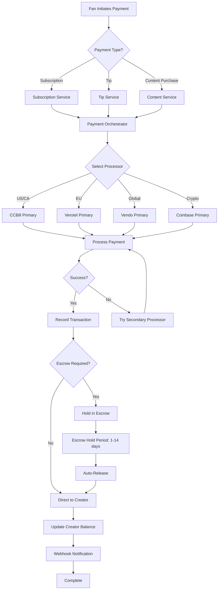
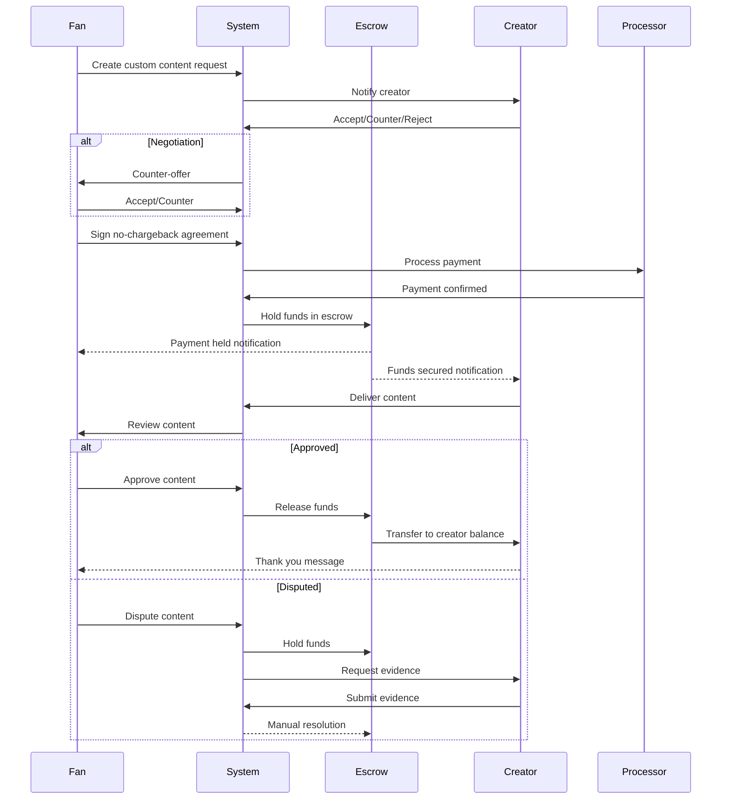
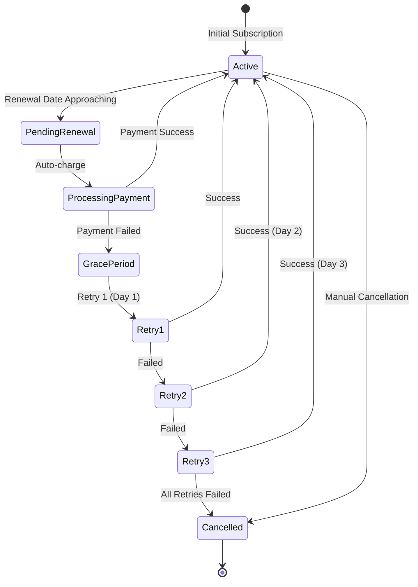
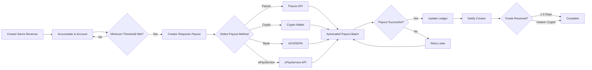
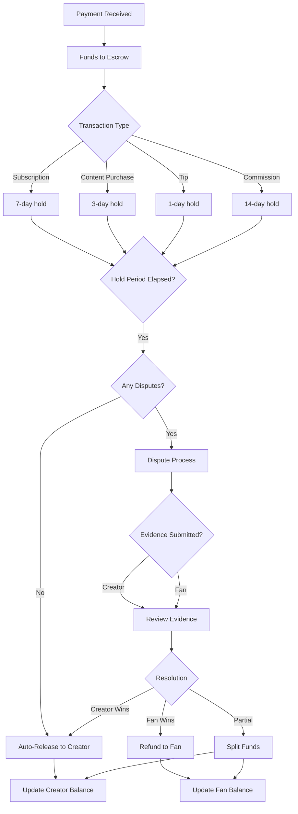
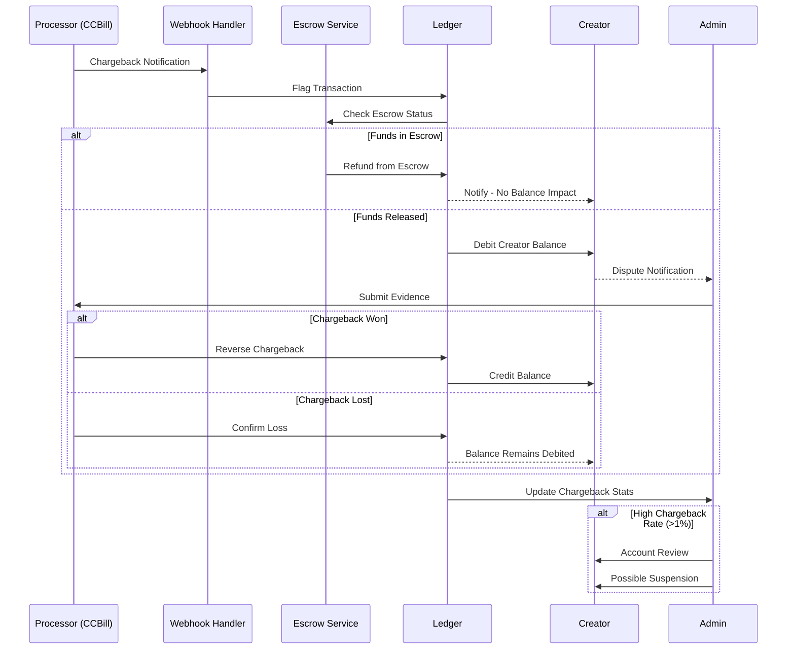

# FANZ Payment Ecosystem - Visual Diagrams & Flows

**Generated:** 2025-11-08
**Purpose:** Visual representation of payment systems, flows, and architecture

---

## Table of Contents

1. [System Architecture Diagram](#system-architecture-diagram)
2. [Payment Processor Ecosystem](#payment-processor-ecosystem)
3. [Payment Flow Diagrams](#payment-flow-diagrams)
4. [Database Schema Relationships](#database-schema-relationships)
5. [API Endpoint Map](#api-endpoint-map)
6. [Platform Payment Distribution](#platform-payment-distribution)

---

## System Architecture Diagram

```
┌─────────────────────────────────────────────────────────────────────────────┐
│                         FANZ UNIFIED ECOSYSTEM                              │
│                        Payment Processing Layer                             │
└─────────────────────────────────────────────────────────────────────────────┘

┌───────────────────────────────────────────────────────────────────────────┐
│                           94 PLATFORMS                                     │
│  ┌──────────┐ ┌──────────┐ ┌──────────┐ ┌──────────┐ ┌──────────┐       │
│  │ boyfanz  │ │girlfanz  │ │ bearfanz │ │ gayfanz  │ │  guyz    │  ...  │
│  └────┬─────┘ └────┬─────┘ └────┬─────┘ └────┬─────┘ └────┬─────┘       │
│       │            │            │            │            │               │
│       └────────────┴────────────┴────────────┴────────────┘               │
│                              │                                             │
└──────────────────────────────┼─────────────────────────────────────────────┘
                               │
                               ▼
┌───────────────────────────────────────────────────────────────────────────┐
│                      PAYMENT ORCHESTRATION LAYER                          │
│                          (FanzDash)                                        │
│  ┌─────────────────────────────────────────────────────────────────────┐  │
│  │  Payment Orchestrator                                               │  │
│  │  - Route selection based on region, currency, amount                │  │
│  │  - MID (Merchant ID) rotation                                       │  │
│  │  - Load balancing across processors                                 │  │
│  │  - Failover & retry logic                                           │  │
│  └─────────────────────────────────────────────────────────────────────┘  │
│                                                                            │
│  ┌─────────────────────────────────────────────────────────────────────┐  │
│  │  Escrow Service                                                     │  │
│  │  - Hold funds (1-14 days)                                           │  │
│  │  - Automatic release                                                │  │
│  │  - Dispute resolution                                               │  │
│  │  - Chargeback protection                                            │  │
│  └─────────────────────────────────────────────────────────────────────┘  │
│                                                                            │
│  ┌─────────────────────────────────────────────────────────────────────┐  │
│  │  Webhook Processor                                                  │  │
│  │  - Real-time event handling                                         │  │
│  │  - Signature verification                                           │  │
│  │  - Transaction updates                                              │  │
│  └─────────────────────────────────────────────────────────────────────┘  │
└───────────────────────────────────────────────────────────────────────────┘
                               │
                ┌──────────────┼──────────────┐
                ▼              ▼              ▼
┌─────────────────────┐ ┌──────────────┐ ┌──────────────────┐
│   CARD PROCESSORS   │ │    CRYPTO    │ │  PAYOUT PROVIDERS│
│                     │ │  PROCESSORS  │ │                  │
│  1. CCBill (10.9%)  │ │ 11. Coinbase │ │ 15. Paxum (2%)   │
│  2. Segpay (11.5%)  │ │ 12. NOWPay   │ │ 16. ePayService  │
│  3. Epoch (12%)     │ │ 13. CoinPay  │ │ 17. Cosmo        │
│  4. Vendo (9.9%)    │ │ 14. BTCPay   │ │ 18. Wise         │
│  5. Verotel (11%)   │ │              │ │ 19. Payoneer     │
│  6. RocketGate      │ │ + 50 coins   │ │ 20. Skrill       │
│  7. NetBilling      │ │              │ │ 21. NETELLER     │
│  8. CommerceGate    │ │              │ │ 22. Crypto       │
│  9. CentroBill      │ │              │ │ 23. ACH/SEPA     │
│ 10. Payze (3.5%)    │ │              │ │                  │
└─────────────────────┘ └──────────────┘ └──────────────────┘
                               │
                               ▼
┌───────────────────────────────────────────────────────────────────────────┐
│                        DATABASE LAYER                                      │
│  ┌───────────┐ ┌───────────┐ ┌───────────┐ ┌───────────┐                │
│  │  Ledger   │ │    CRM    │ │ Commerce  │ │ Discrete  │                │
│  │  Schema   │ │  Schema   │ │  Schema   │ │  Schema   │                │
│  │           │ │           │ │           │ │           │                │
│  │ 6 tables  │ │ 7 tables  │ │ 6 tables  │ │ 8 tables  │                │
│  └───────────┘ └───────────┘ └───────────┘ └───────────┘                │
│                                                                            │
│  Total: 27 payment-related tables                                         │
└───────────────────────────────────────────────────────────────────────────┘
```

---

## Payment Processor Ecosystem

### Processor Priority & Routing

```
┌─────────────────────────────────────────────────────────────────────────┐
│                   PAYMENT PROCESSOR SELECTION LOGIC                      │
└─────────────────────────────────────────────────────────────────────────┘

                          Transaction Request
                                  │
                                  ▼
                    ┌─────────────────────────┐
                    │   Analyze Transaction   │
                    │  - Region               │
                    │  - Currency             │
                    │  - Amount               │
                    │  - Payment Method       │
                    └───────────┬─────────────┘
                                │
                ┌───────────────┼───────────────┐
                ▼               ▼               ▼
        ┌──────────────┐ ┌───────────┐ ┌──────────────┐
        │    US/CA     │ │    EU     │ │    GLOBAL    │
        └──────┬───────┘ └─────┬─────┘ └──────┬───────┘
               │               │               │
               ▼               ▼               ▼
        ┌──────────────┐ ┌───────────┐ ┌──────────────┐
        │ CCBill (P1)  │ │ Verotel   │ │ Vendo (P1)   │
        │ Segpay (P2)  │ │ CommerceG │ │ CCBill (P2)  │
        │ Epoch (P3)   │ │ Epoch     │ │ Segpay (P3)  │
        └──────────────┘ └───────────┘ └──────────────┘

                Amount-Based Routing
                        │
        ┌───────────────┼───────────────┐
        ▼               ▼               ▼
    ┌────────┐    ┌──────────┐    ┌──────────┐
    │ < $50  │    │$50-$200  │    │ > $1000  │
    └───┬────┘    └────┬─────┘    └────┬─────┘
        │              │               │
        ▼              ▼               ▼
    Crypto (0.5%)  Coinbase (1%)   Wise (0.5%)
    BTCPay (0%)    Paxum (2%)      Card (10%)

                Payment Method
                        │
        ┌───────────────┼───────────────┐
        ▼               ▼               ▼
    ┌────────┐    ┌──────────┐    ┌──────────┐
    │  Card  │    │  Crypto  │    │  Wallet  │
    └───┬────┘    └────┬─────┘    └────┬─────┘
        │              │               │
        ▼              ▼               ▼
    CCBill         Coinbase         Paxum
    Segpay         NOWPayments      Skrill
    Epoch          BTCPay           NETELLER
```

### Processor Feature Matrix

```
┌────────────────────────────────────────────────────────────────────────────┐
│  Processor    │ Recurring │ Escrow │ 3DS │ Crypto │ Instant │ Chargeback  │
│               │  Billing  │        │     │        │ Payout  │ Protection  │
├───────────────┼───────────┼────────┼─────┼────────┼─────────┼─────────────┤
│ CCBill        │    ✅     │   ✅   │ ✅  │   ❌   │   ❌    │     ✅      │
│ Segpay        │    ✅     │   ✅   │ ✅  │   ❌   │   ❌    │     ✅      │
│ Epoch         │    ✅     │   ✅   │ ✅  │   ❌   │   ❌    │     ✅      │
│ Vendo         │    ✅     │   ✅   │ ✅  │   ❌   │   ❌    │     ✅      │
│ Verotel       │    ✅     │   ✅   │ ✅  │   ❌   │   ❌    │     ✅      │
│ RocketGate    │    ✅     │   ✅   │ ✅  │   ❌   │   ❌    │     ✅      │
│ NetBilling    │    ✅     │   ❌   │ ✅  │   ❌   │   ❌    │     ✅      │
│ CommerceGate  │    ✅     │   ✅   │ ✅  │   ❌   │   ❌    │     ✅      │
│ CentroBill    │    ✅     │   ✅   │ ✅  │   ❌   │   ❌    │     ✅      │
│ Payze         │    ✅     │   ✅   │ ✅  │   ❌   │   ✅    │     ✅      │
├───────────────┼───────────┼────────┼─────┼────────┼─────────┼─────────────┤
│ Coinbase      │    ✅     │   ✅   │ N/A │   ✅   │   ✅    │     ✅      │
│ NOWPayments   │    ✅     │   ✅   │ N/A │   ✅   │   ✅    │     ✅      │
│ CoinPayments  │    ❌     │   ✅   │ N/A │   ✅   │   ✅    │     ✅      │
│ BTCPay        │    ❌     │   ✅   │ N/A │   ✅   │   ✅    │     ✅      │
├───────────────┼───────────┼────────┼─────┼────────┼─────────┼─────────────┤
│ Paxum         │    ❌     │   ✅   │ ✅  │   ❌   │   ✅    │     ❌      │
│ ePayService   │    ❌     │   ✅   │ ✅  │   ❌   │   ✅    │     ❌      │
│ Cosmo         │    ❌     │   ❌   │ ✅  │   ❌   │   ❌    │     ❌      │
│ Wise          │    ❌     │   ❌   │ ✅  │   ❌   │   ❌    │     ❌      │
│ Payoneer      │    ❌     │   ❌   │ ✅  │   ❌   │   ❌    │     ❌      │
└───────────────┴───────────┴────────┴─────┴────────┴─────────┴─────────────┘
```

---

## Payment Flow Diagrams

### Flow 1: Standard Payment Processing



### Flow 2: Custom Content Request Payment



### Flow 3: Subscription Renewal



### Flow 4: Creator Payout Process



### Flow 5: Escrow & Dispute Resolution



### Flow 6: Chargeback Handling



---

## Database Schema Relationships

### Ledger Schema Relationships

```
┌─────────────────────────────────────────────────────────────────────────┐
│                          LEDGER SCHEMA                                   │
└─────────────────────────────────────────────────────────────────────────┘

┌────────────────────┐         ┌────────────────────┐
│  ledger.accounts   │◄────────┤ledger.transactions │
│                    │  1:N    │                    │
│ - account_id (PK)  │         │ - transaction_id   │
│ - user_id          │         │ - account_id (FK)  │
│ - account_type     │         │ - type             │
│ - balance          │         │ - amount           │
│ - currency         │         │ - processor        │
└─────────┬──────────┘         │ - status           │
          │                    │ - escrow_status    │
          │                    └────────┬───────────┘
          │                             │
          │ 1:N                         │ 1:N
          │                             │
          ▼                             ▼
┌────────────────────┐         ┌────────────────────┐
│  ledger.balances   │         │  ledger.payouts    │
│                    │         │                    │
│ - balance_id (PK)  │         │ - payout_id (PK)   │
│ - account_id (FK)  │         │ - transaction_id   │
│ - available        │         │ - creator_id       │
│ - pending          │         │ - amount           │
│ - held             │         │ - method           │
│ - currency         │         │ - status           │
└────────────────────┘         │ - processor_tx_id  │
                               └────────────────────┘

┌────────────────────┐
│ledger.revshare_rules│
│                    │
│ - rule_id (PK)     │
│ - platform_id      │
│ - creator_pct      │
│ - platform_pct     │
│ - affiliate_pct    │
└────────────────────┘
```

### CRM Schema - Payment Relationships

```
┌─────────────────────────────────────────────────────────────────────────┐
│                           CRM SCHEMA                                     │
└─────────────────────────────────────────────────────────────────────────┘

┌────────────────────┐         ┌────────────────────┐
│  fans.subscriptions│◄────────┤  creators.sub_tiers│
│                    │  N:1    │                    │
│ - subscription_id  │         │ - tier_id (PK)     │
│ - fan_id           │         │ - creator_id       │
│ - creator_id       │         │ - tier_name        │
│ - tier_id (FK)     │         │ - price            │
│ - billing_cycle    │         │ - currency         │
│ - next_bill_date   │         │ - billing_cycle    │
│ - status           │         └────────────────────┘
│ - processor        │
└─────────┬──────────┘
          │
          │ 1:N
          │
          ▼
┌────────────────────┐
│    fans.tips       │
│                    │
│ - tip_id (PK)      │
│ - fan_id           │
│ - creator_id       │
│ - amount           │
│ - processor        │
│ - transaction_id   │
└────────────────────┘
```

### Commerce Schema - Order Payments

```
┌─────────────────────────────────────────────────────────────────────────┐
│                        COMMERCE SCHEMA                                   │
└─────────────────────────────────────────────────────────────────────────┘

┌────────────────────┐         ┌────────────────────┐
│  orders.orders     │◄────────┤ orders.order_items │
│                    │  1:N    │                    │
│ - order_id (PK)    │         │ - item_id (PK)     │
│ - user_id          │         │ - order_id (FK)    │
│ - total_amount     │         │ - product_id (FK)  │
│ - processor        │         │ - quantity         │
│ - payment_status   │         │ - unit_price       │
│ - escrow_status    │         │ - subtotal         │
└─────────┬──────────┘         └─────────┬──────────┘
          │                              │
          │                              │ N:1
          │                              │
          │                              ▼
          │                    ┌────────────────────┐
          │                    │ products.products  │
          │                    │                    │
          │                    │ - product_id (PK)  │
          │                    │ - creator_id       │
          │                    │ - price            │
          │                    │ - type             │
          │                    └────────────────────┘
          │
          │ N:1
          │
          ▼
┌────────────────────┐         ┌────────────────────┐
│affiliates.affiliates│◄────────┤affiliates.commissions│
│                    │  1:N    │                    │
│ - affiliate_id(PK) │         │ - commission_id    │
│ - user_id          │         │ - affiliate_id (FK)│
│ - commission_rate  │         │ - order_id (FK)    │
│ - payout_method    │         │ - commission_amt   │
└────────────────────┘         │ - status           │
                               └────────────────────┘
```

### Discrete Schema - Privacy Payments

```
┌─────────────────────────────────────────────────────────────────────────┐
│                        DISCRETE SCHEMA                                   │
└─────────────────────────────────────────────────────────────────────────┘

┌────────────────────┐         ┌────────────────────┐
│discrete.cards      │◄────────┤ discrete.card_loads│
│                    │  1:N    │                    │
│ - card_id (PK)     │         │ - load_id (PK)     │
│ - user_id          │         │ - card_id (FK)     │
│ - card_number      │         │ - amount           │
│ - balance          │         │ - processor        │
│ - billing_desc     │         │ - transaction_id   │
│ - status           │         └────────────────────┘
└─────────┬──────────┘
          │
          │ 1:N
          │
          ▼
┌────────────────────┐
│discrete.card_spends│
│                    │
│ - spend_id (PK)    │
│ - card_id (FK)     │
│ - amount           │
│ - platform_id      │
│ - description      │
└────────────────────┘

┌────────────────────┐         ┌────────────────────┐
│discrete.ccbill_merch│         │discrete.descriptor_│
│                    │         │     templates      │
│ - merchant_id (PK) │         │                    │
│ - client_accnum    │         │ - template_id (PK) │
│ - client_subacc    │         │ - descriptor_text  │
│ - form_name        │         │ - processor        │
│ - salt             │         │ - usage_count      │
│ - enabled          │         └────────────────────┘
└────────────────────┘
```

---

## API Endpoint Map

### Payment API Hierarchy

```
/api
├── /payment                          [Main Payment Processing]
│   ├── POST   /process               Process payment
│   ├── GET    /gateways              List processors
│   ├── GET    /payout-methods        Payout options
│   ├── POST   /payout                Execute payout
│   ├── GET    /transaction/:id       Transaction status
│   ├── PUT    /routing/:ruleId       Payment routing (Admin)
│   ├── POST   /mid/:midId/:action    MID control (Admin)
│   ├── GET    /health                Health check
│   ├── POST   /webhook/:gatewayId    Webhook receiver
│   └── GET    /events                SSE event stream
│
├── /payment-admin                    [Payment Administration]
│   ├── /processors
│   │   ├── GET    /                  List all processors
│   │   ├── GET    /:id               Get specific processor
│   │   ├── GET    /type/:type        Filter by type
│   │   └── GET    /region/:region    Filter by region
│   ├── GET    /crypto-processors     Crypto processors
│   ├── GET    /payout-providers      Payout providers
│   ├── GET    /currencies            Supported currencies
│   ├── POST   /best-processor        Recommend processor
│   ├── GET    /overview              System overview
│   └── /escrow
│       ├── GET    /stats             Escrow statistics
│       ├── GET    /account/:userId   User escrow balance
│       ├── GET    /pending/:userId   Pending transactions
│       ├── GET    /history/:userId   Transaction history
│       ├── POST   /hold              Hold funds
│       ├── POST   /release/:txId     Release funds
│       ├── POST   /refund/:txId      Refund funds
│       ├── POST   /dispute           Create dispute
│       ├── POST   /resolve-dispute/:disputeId  Resolve dispute
│       └── GET    /processors        Escrow-capable processors
│
├── /custom-content                   [Custom Content Payments]
│   ├── POST   /request               Create request with payment
│   ├── POST   /creator-respond/:id   Creator response
│   ├── POST   /fan-respond/:id       Fan response
│   ├── POST   /sign-agreement/:id    Sign agreement
│   ├── POST   /accept-terms/:id      Accept terms
│   ├── POST   /process-payment/:id   Process to escrow
│   ├── POST   /deliver/:id           Deliver content
│   ├── POST   /review/:id            Review/approve (release escrow)
│   ├── GET    /request/:id           Get request details
│   ├── GET    /user/:userId/:role    Get user requests
│   ├── GET    /platform/:platformId  Get platform requests
│   └── GET    /status/:status        Filter by status
│
├── /payouts                          [Creator Payouts]
│   ├── /creators
│   │   ├── POST   /register          Register creator
│   │   ├── GET    /:creatorId        Creator profile
│   │   ├── GET    /user/:userId      Get by user ID
│   │   └── POST   /:creatorId/payout-methods  Add payout method
│   ├── /revenue
│   │   └── POST   /record            Record revenue
│   ├── GET    /creators/:id/earnings Creator earnings
│   ├── POST   /request               Request payout
│   ├── GET    /request/:payoutId     Payout status
│   ├── GET    /creators/:id/history  Payout history
│   ├── GET    /methods               Supported methods
│   ├── /admin
│   │   ├── GET    /stats             System stats
│   │   └── POST   /batch             Batch payouts
│   └── /automation
│       ├── GET    /stats             Automation stats
│       ├── POST   /revenue           Record with auto-eval
│       ├── POST   /payout-methods    Add automated method
│       ├── POST   /payout-request    Automated payout
│       ├── GET    /ledger/:creatorId Creator ledger
│       ├── GET    /payout-requests/:creatorId  Payout requests
│       ├── GET    /batches           Payout batches
│       └── POST   /control/:action   Start/stop automation
│
├── /discreet                         [FanzDiscreet Privacy Cards]
│   ├── POST   /purchase              Purchase card
│   ├── GET    /cards                 List cards
│   ├── GET    /cards/:cardId         Card details
│   ├── POST   /cards/:cardId/reload  Reload card
│   ├── DELETE /cards/:cardId         Deactivate card
│   ├── GET    /cards/:cardId/usage   Usage summary
│   └── /webhooks
│       └── POST   /ccbill            CCBill webhooks
│
└── /fanz-card-webhooks               [Platform Card Webhooks]
    ├── POST   /authorize             Authorize transaction
    └── POST   /settle                Settle transaction
```

---

## Platform Payment Distribution

### 94 Platforms - Payment Flow

```
┌─────────────────────────────────────────────────────────────────────────┐
│                      94 PLATFORM ARCHITECTURE                            │
└─────────────────────────────────────────────────────────────────────────┘

Core Platforms (13) - Full Integration
─────────────────────────────────────
┌──────────┐  ┌──────────┐  ┌──────────┐  ┌──────────┐
│ boyfanz  │  │girlfanz  │  │ pupfanz  │  │transfanz │
└────┬─────┘  └────┬─────┘  └────┬─────┘  └────┬─────┘
     │            │            │            │
     └────────────┴────────────┴────────────┘
                  │
┌──────────┐  ┌──────────┐  ┌──────────┐  ┌──────────┐
│ bearfanz │  │cougarfanz│  │ gayfanz  │  │femmefanz │
└────┬─────┘  └────┬─────┘  └────┬─────┘  └────┬─────┘
     │            │            │            │
     └────────────┴────────────┴────────────┘
                  │
┌──────────┐  ┌──────────┐  ┌──────────┐  ┌──────────┐
│   guyz   │  │  dlbroz  │  │southernfanz│ │taboofanz│
└────┬─────┘  └────┬─────┘  └────┬─────┘  └────┬─────┘
     │            │            │            │
     └────────────┴────────────┴────────────┘
                  │
         ┌────────────────┐
         │  fanzuncut     │
         └────────┬───────┘
                  │
                  ▼
         ┌────────────────────────┐
         │   FANZDASH             │
         │   Payment Orchestrator │
         └────────┬───────────────┘
                  │
      ┌───────────┼───────────┐
      ▼           ▼           ▼
  ┌────────┐ ┌────────┐ ┌────────┐
  │CCBill  │ │Coinbase│ │ Paxum  │
  │Segpay  │ │NOWPay  │ │ePaySvc │
  │Epoch   │ │CoinPay │ │ Cosmo  │
  │Vendo   │ │BTCPay  │ │ Wise   │
  └────────┘ └────────┘ └────────┘

Extended Platforms (81+) - Centralized Routing
───────────────────────────────────────────────
All route through FanzDash orchestration layer

┌────────────────────────────────────────────┐
│  fanzflix  │  fanztube  │  fanzcams  │ ... │
│  fanzpix   │  fanzmusic │  fanzvr    │ ... │
│  (81 more platforms)                      │
└───────────────────┬────────────────────────┘
                    │
                    ▼
            ┌───────────────┐
            │   FANZDASH    │
            │ Orchestration │
            └───────────────┘
```

### Regional Processor Distribution

```
United States & Canada (40 platforms)
══════════════════════════════════════
Primary:    CCBill (10.9%)
Secondary:  Segpay (11.5%)
Tertiary:   Epoch (12%)
Crypto:     Coinbase Commerce (1%)
Payout:     Paxum (2%)

Europe (25 platforms)
══════════════════════
Primary:    Verotel (11%)
Secondary:  CommerceGate (11.5%)
Tertiary:   Epoch (12%)
Crypto:     NOWPayments (0.5%)
Payout:     ePayService (1.5%)

Global/Multi-Region (29 platforms)
═══════════════════════════════════
Primary:    Vendo (9.9%)
Secondary:  CCBill (10.9%)
Tertiary:   Segpay (11.5%)
Crypto:     CoinPayments (0.5%)
Payout:     Wise (0.5%)
```

---

## Revenue Flow Diagram

### Complete Money Flow Through System

```
┌─────────────────────────────────────────────────────────────────────────┐
│                         REVENUE FLOW DIAGRAM                             │
└─────────────────────────────────────────────────────────────────────────┘

Fan Payment ($100)
       │
       ▼
┌─────────────────┐
│  Payment Gateway│  ← Processor Fee (10.9% = $10.90)
│    (CCBill)     │
└────────┬────────┘
         │
         ▼ $89.10
┌─────────────────┐
│  Escrow Account │  ← Hold Period (7 days)
└────────┬────────┘
         │
         ▼ After hold period
┌─────────────────┐
│ Platform Account│  ← Platform Fee (15% of $89.10 = $13.37)
└────────┬────────┘
         │
         ▼ $75.73
┌─────────────────┐
│ Creator Account │  ← Available for payout
└────────┬────────┘
         │
         ▼ Creator requests payout
┌─────────────────┐
│  Payout Provider│  ← Payout Fee (2% of $75.73 = $1.51)
│     (Paxum)     │
└────────┬────────┘
         │
         ▼ $74.22
┌─────────────────┐
│ Creator Receives│  (74.22% of original $100)
└─────────────────┘


FEE BREAKDOWN:
──────────────
Original Payment:       $100.00
- Processor Fee (CCBill): -$10.90 (10.9%)
- Platform Fee:          -$13.37 (15% of $89.10)
- Payout Fee (Paxum):    -$1.51  (2% of $75.73)
━━━━━━━━━━━━━━━━━━━━━━━━━━━━━━━━━
Creator Net:            $74.22   (74.22%)

OPTIMIZATION WITH CRYPTO:
─────────────────────────
Original Payment:       $100.00
- Processor Fee (BTCPay): $0.00  (0%)
- Platform Fee:          -$15.00 (15% of $100)
- Payout Fee (Crypto):   $0.00   (0%)
━━━━━━━━━━━━━━━━━━━━━━━━━━━━━━━━━
Creator Net:            $85.00   (85%)
                        ↑ +$10.78 vs card payment
```

---

## Webhook Event Flow

```
┌─────────────────────────────────────────────────────────────────────────┐
│                      WEBHOOK EVENT PROCESSING                            │
└─────────────────────────────────────────────────────────────────────────┘

Processor (CCBill)
       │
       │ POST /api/payment/webhook/ccbill
       ▼
┌─────────────────┐
│ Webhook Handler │
│                 │
│ 1. Verify Sig   │  ← HMAC-SHA256 signature validation
│ 2. Parse Event  │
│ 3. Validate     │
└────────┬────────┘
         │
         ▼
    ┌────────────┐
    │ Event Type?│
    └────┬───────┘
         │
    ┌────┼────┬────┬────┬────┬────┬────┐
    ▼    ▼    ▼    ▼    ▼    ▼    ▼    ▼
┌────────┐┌────┐┌────┐┌────┐┌────┐┌────┐┌────┐┌────┐
│NewSale ││Fail││Rnwl││Cncl││CB  ││Rfnd││Exp ││Updt│
└───┬────┘└─┬──┘└─┬──┘└─┬──┘└─┬──┘└─┬──┘└─┬──┘└─┬──┘
    │       │     │     │     │     │     │     │
    ▼       ▼     ▼     ▼     ▼     ▼     ▼     ▼
┌─────────────────────────────────────────────────────┐
│          Update Database (ledger.transactions)       │
└───────────────────────┬─────────────────────────────┘
                        │
                        ▼
                ┌───────────────┐
                │ Escrow Action?│
                └───────┬───────┘
                        │
                ┌───────┼───────┐
                ▼       ▼       ▼
            ┌────┐  ┌────┐  ┌────┐
            │Hold│  │Rel │  │Rfnd│
            └─┬──┘  └─┬──┘  └─┬──┘
              │       │       │
              └───────┴───────┘
                      │
                      ▼
              ┌───────────────┐
              │ Send Notif    │
              │ - Email       │
              │ - Push        │
              │ - Webhook     │
              └───────┬───────┘
                      │
                      ▼
              ┌───────────────┐
              │ Emit SSE Event│
              │ (Real-time UI)│
              └───────────────┘

Legend:
NewSale = New Sale Success
Fail    = New Sale Failure
Rnwl    = Renewal
Cncl    = Cancellation
CB      = Chargeback
Rfnd    = Refund
Exp     = Expiration
Updt    = Update
```

---

## Security & Compliance Flow

```
┌─────────────────────────────────────────────────────────────────────────┐
│                   SECURITY & COMPLIANCE LAYERS                           │
└─────────────────────────────────────────────────────────────────────────┘

Payment Request
       │
       ▼
┌─────────────────┐
│ 1. Authentication│  ← API Key, JWT, Bearer Token
│    & Rate Limit  │
└────────┬────────┘
         │
         ▼
┌─────────────────┐
│ 2. Fraud Check  │  ← Risk Scoring (0-100)
│                 │    - IP Geolocation
│                 │    - Velocity Checking
│                 │    - Blacklist Lookup
│                 │    - Device Fingerprint
└────────┬────────┘
         │
         ▼ Score < 75 (low risk)
┌─────────────────┐
│ 3. KYC/AML      │  ← Required for $100+
│    Verification │    - Identity verification
│                 │    - Age verification (18+)
│                 │    - Address verification
└────────┬────────┘
         │
         ▼
┌─────────────────┐
│ 4. 3D Secure    │  ← Required for high-risk
│    (if required)│    - Cardholder auth
│                 │    - Bank verification
└────────┬────────┘
         │
         ▼
┌─────────────────┐
│ 5. Process      │  ← Via selected processor
│    Payment      │
└────────┬────────┘
         │
         ▼
┌─────────────────┐
│ 6. Encrypt &    │  ← TLS 1.3, AES-256
│    Store Token  │    - No card data stored
│                 │    - Token only
└────────┬────────┘
         │
         ▼
┌─────────────────┐
│ 7. Audit Log    │  ← Complete transaction trail
│                 │    - User ID, IP, timestamp
│                 │    - Amount, processor, status
│                 │    - Compliance metadata
└────────┬────────┘
         │
         ▼
┌─────────────────┐
│ 8. Tax Tracking │  ← For 1099-K, VAT
│                 │    - Creator earnings
│                 │    - Annual reporting
└─────────────────┘

Compliance Standards:
─────────────────────
✅ PCI DSS Level 1
✅ GDPR (EU)
✅ CCPA (California)
✅ AML/KYC
✅ 18 U.S.C. § 2257 (Age verification)
✅ SOC 2 Type II (in progress)
```

---

## Summary

This document provides comprehensive visual representations of:

1. **System Architecture** - How all components connect
2. **Payment Processor Ecosystem** - All 20+ processors and their features
3. **Payment Flows** - 6 complete transaction flows with diagrams
4. **Database Relationships** - 27 tables across 4 schemas
5. **API Endpoint Map** - 70+ endpoints organized hierarchically
6. **Platform Distribution** - 94 platforms and processor routing
7. **Revenue Flow** - Complete money flow with fee breakdowns
8. **Webhook Processing** - Real-time event handling
9. **Security Layers** - 8-step security and compliance flow

**Total Diagrams:** 15+
**Total Flows:** 6 complete payment flows
**Visual Format:** ASCII art, Mermaid, hierarchical trees

---

**Document Version:** 1.0
**Last Updated:** 2025-11-08
**Format:** Markdown with Mermaid diagram support
