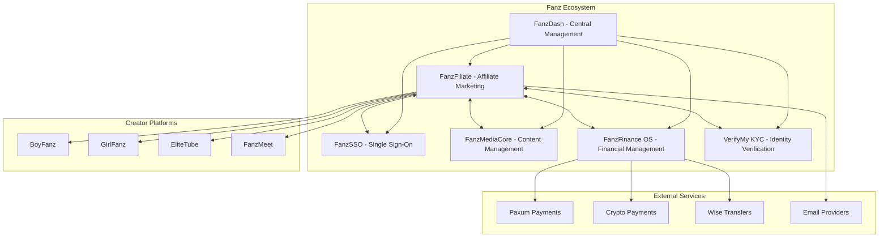

# FanzFiliate - Fanz Ecosystem Integration

## Overview

**FanzFiliate** is a core component of the **Fanz Ecosystem**, serving as the comprehensive affiliate marketing platform that connects creators, advertisers, and partners within the adult-friendly content economy.

## 🌐 Fanz Ecosystem Architecture

FanzFiliate operates as part of a larger interconnected ecosystem of platforms and services designed to support adult content creators and businesses:

### Core Fanz Ecosystem Components



## 🔧 Integration Points

### 1. **FanzDash Integration** - Central Command Center
- **Purpose**: Centralized management dashboard for the entire Fanz ecosystem
- **Features**:
  - Unified user management across all platforms
  - Cross-platform analytics and reporting
  - Resource orchestration and deployment management
  - Real-time monitoring and alerting

**API Integration**:
```typescript
// FanzDash service integration
const fanzDashService = {
  clusterId: 'fanzfiliate',
  apiUrl: process.env.FANZDASH_API_URL,
  publishMetrics: () => {/* Platform metrics */},
  publishEvents: () => {/* User events */},
  registerCluster: () => {/* Platform registration */}
};
```

### 2. **FanzSSO Integration** - Unified Authentication
- **Purpose**: Single Sign-On across all Fanz ecosystem platforms
- **Features**:
  - Seamless user authentication across platforms
  - Unified user profiles and preferences
  - Cross-platform session management
  - OAuth 2.0 and JWT token validation

**Authentication Flow**:
```typescript
// SSO login integration
const ssoLogin = async (ssoToken, ssoUserId) => {
  const validation = await fanzSSOService.validateSSOToken(ssoToken, ssoUserId);
  if (validation.valid) {
    // Auto-create or update local user profile
    // Generate platform-specific JWT tokens
    // Track login across ecosystem
  }
};
```

### 3. **FanzMediaCore Integration** - Content Management
- **Purpose**: Centralized media and creative asset management
- **Features**:
  - Creative asset storage and optimization
  - A/B testing for marketing materials
  - Content delivery network (CDN) integration
  - Adult-content compliant hosting

**Media Integration**:
```typescript
// Creative asset management
const mediaCore = {
  uploadCreative: (file, metadata) => {/* Upload to MediaCore */},
  optimizeImage: (imageId, dimensions) => {/* Auto-optimize */},
  trackPerformance: (creativeId) => {/* Performance metrics */}
};
```

### 4. **FanzFinance OS Integration** - Financial Management
- **Purpose**: Comprehensive financial operations and compliance
- **Features**:
  - Multi-currency support and conversion
  - Adult-friendly payment processing
  - Automated tax compliance and reporting
  - Real-time financial analytics

**Financial Integration**:
```typescript
// Payout processing through FanzFinance OS
const financeOS = {
  processPayout: (affiliateId, amount, currency) => {
    // Validate KYC compliance
    // Process through adult-friendly providers
    // Update ledger with double-entry accounting
    // Generate tax documentation
  }
};
```

### 5. **VerifyMy KYC Integration** - Identity Verification
- **Purpose**: Know Your Customer compliance and identity verification
- **Features**:
  - 3-tier verification system (KYC 0-3)
  - Progressive earning limits based on verification level
  - Adult-industry compliant verification
  - Real-time status updates via webhooks

**KYC Integration**:
```typescript
// KYC status management
const kycService = {
  webhook: '/api/webhooks/kyc/verifymy',
  statusLevels: {
    0: { limit: '$100' },   // Unverified
    1: { limit: '$1,000' },  // Basic verification
    2: { limit: '$10,000' }, // Enhanced verification
    3: { limit: 'unlimited' } // Full verification
  }
};
```

## 🎯 Cross-Platform Features

### Unified User Experience
- **Single Account**: Users sign in once and access all Fanz ecosystem platforms
- **Consistent Branding**: Unified design language across all platforms
- **Cross-Platform Rewards**: Earnings and rewards that work across all platforms

### Creator Economy Integration
- **Content Monetization**: Direct integration with creator platforms (BoyFanz, GirlFanz)
- **Affiliate Opportunities**: Creators can promote each other's content
- **Revenue Sharing**: Transparent revenue sharing across the ecosystem

### Adult-Friendly Infrastructure
- **Payment Processing**: Specialized payment providers that support adult content
- **Content Compliance**: Built-in compliance with adult content regulations
- **Privacy Protection**: Enhanced privacy features for adult content creators

## 📊 Data Flow and Analytics

### Real-Time Data Synchronization
```typescript
// Cross-platform event tracking
const ecosystemEvents = {
  userRegistration: (user) => fanzDash.publishEvent('user_registered', user),
  conversionTracking: (conversion) => fanzDash.publishEvent('conversion', conversion),
  payoutProcessed: (payout) => fanzDash.publishEvent('payout', payout),
  kycStatusChange: (user, status) => fanzDash.publishEvent('kyc_update', { user, status })
};
```

### Unified Analytics Dashboard
- **Cross-Platform Metrics**: View performance across all Fanz platforms
- **Revenue Attribution**: Track revenue sources across the ecosystem
- **User Journey Analysis**: Understand user behavior across platforms

## 🔒 Security and Compliance

### Ecosystem-Wide Security
- **Centralized Security Monitoring**: Security events monitored across all platforms
- **Fraud Detection**: ML-powered fraud detection with cross-platform data
- **Adult Content Compliance**: Built-in compliance with adult content regulations

### Privacy and Data Protection
- **GDPR Compliance**: Full GDPR compliance across the ecosystem
- **Data Sovereignty**: User data ownership and portability
- **Privacy by Design**: Privacy-first architecture across all platforms

## 🚀 Deployment and Scaling

### Infrastructure Management
- **Microservices Architecture**: Each platform operates as an independent microservice
- **Container Orchestration**: Docker and Kubernetes deployment
- **Auto-Scaling**: Automatic scaling based on demand across platforms

### Development Workflow
- **Continuous Integration**: Automated testing and deployment
- **Feature Flags**: Gradual feature rollout across the ecosystem
- **A/B Testing**: Cross-platform experimentation framework

## 📈 Business Model Integration

### Revenue Streams
1. **Affiliate Commissions**: Performance-based affiliate marketing
2. **Platform Fees**: Transaction fees across the ecosystem (kept minimal)
3. **Premium Services**: Enhanced features and analytics
4. **White-Label Solutions**: Custom implementations for partners

### Competitive Advantages
- **0% Platform Fees**: Creators keep 100% of earnings
- **Adult-Friendly**: No content restrictions or arbitrary suspensions
- **Integrated Ecosystem**: Seamless experience across all platforms
- **Creator-First**: Built specifically for adult content creators

## 🔮 Future Roadmap

### Planned Integrations
- **FanzLab 2.0**: Advanced analytics and AI-powered insights
- **FanzMarketplace**: Decentralized marketplace for adult content
- **FanzNFT**: NFT platform for adult content creators
- **FanzDAO**: Decentralized governance for the ecosystem

### Technology Evolution
- **Blockchain Integration**: Decentralized payments and governance
- **AI-Powered Features**: Automated content optimization and fraud detection
- **Mobile-First**: Native mobile apps for all platforms
- **Global Expansion**: Multi-language and multi-currency support

## 📞 Support and Documentation

### Developer Resources
- **API Documentation**: Comprehensive API docs for all integrations
- **SDKs**: Official SDKs for major programming languages
- **Webhooks**: Real-time event notifications across platforms
- **Testing Environment**: Sandbox environment for development and testing

### Community Support
- **Developer Portal**: Resources and documentation for developers
- **Community Forum**: Support and discussion for ecosystem partners
- **Partner Program**: Official partnership opportunities
- **Technical Support**: Dedicated support for integration partners

---

**FanzFiliate** is more than just an affiliate marketing platform—it's a cornerstone of the Fanz Ecosystem, designed to empower adult content creators with the tools, infrastructure, and community they need to build sustainable businesses in a creator-friendly environment.

For more information about specific integrations or to become a partner in the Fanz Ecosystem, contact our developer relations team.
