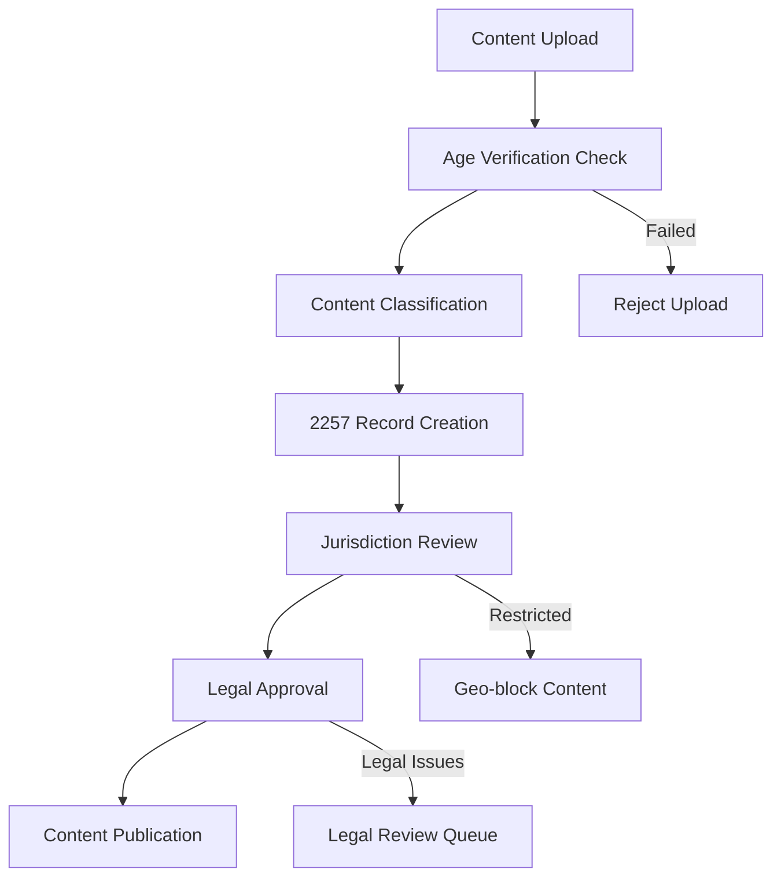
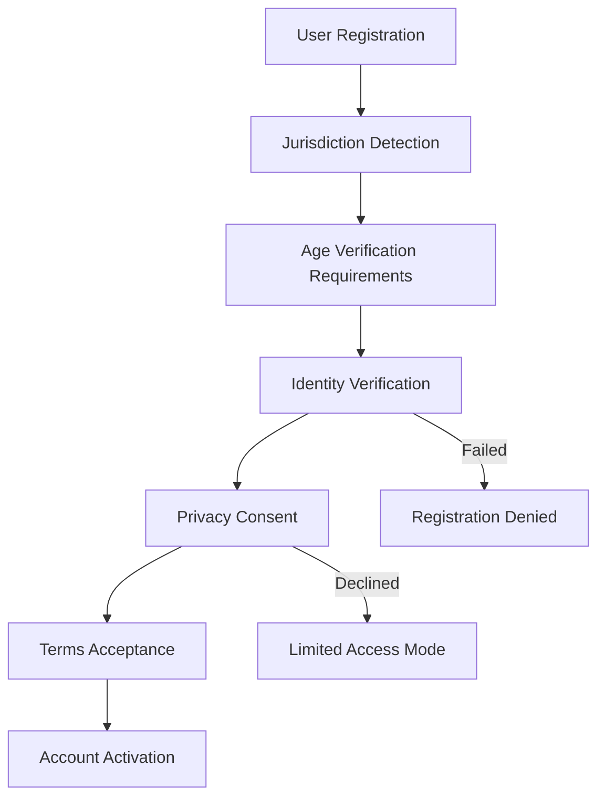

# 🏛️ FanzCompliance - Global Legal Compliance Framework

> **Comprehensive legal compliance system for adult content platforms**  
> Ensuring compliance with international, federal, state, and local laws across all jurisdictions

## 📋 Overview

FanzCompliance provides a comprehensive legal framework to ensure the FANZ ecosystem complies with all applicable laws regarding adult content across different countries, states, and localities. This includes age verification, content labeling, record keeping, privacy compliance, and jurisdiction-specific requirements.

## 🌍 Jurisdictional Coverage

### **United States**
- **Federal**: 18 USC 2257 (Record Keeping Requirements)
- **Federal**: FOSTA-SESTA compliance
- **Federal**: COPPA (Children's Online Privacy Protection Act)
- **State**: California CCPA/CPRA
- **State**: Texas age verification requirements
- **State**: Florida content restriction laws
- **State**: Louisiana age verification mandate
- **Local**: County and city ordinances

### **European Union**
- **GDPR**: General Data Protection Regulation
- **Digital Services Act**: Content moderation requirements
- **Audiovisual Media Services Directive**: Content classification
- **Country-specific**: Germany (JMStV), UK (Age Verification)
- **Country-specific**: France (CSA regulations)

### **Asia-Pacific**
- **Australia**: eSafety Commissioner requirements
- **Japan**: Act on Regulation of Transmission of Specified Electronic Mail
- **South Korea**: Information and Communications Network Act
- **Singapore**: Broadcasting (Class Licence) Regulations
- **India**: Information Technology Rules

### **Other Regions**
- **Canada**: Personal Information Protection and Electronic Documents Act (PIPEDA)
- **Brazil**: Marco Civil da Internet, Lei Geral de Proteção de Dados (LGPD)
- **South Africa**: Protection of Personal Information Act (POPIA)

## 🔒 Core Compliance Components

### 1. **Age Verification & Identity**
- Multi-factor age verification
- Government ID verification
- Biometric verification (optional)
- Credit card verification
- Phone number verification
- Ongoing age assurance

### 2. **Content Classification & Labeling**
- RTA (Restricted to Adults) labeling
- ICRA (Internet Content Rating Association) tags
- Custom content rating system
- Automated content classification
- Human review processes

### 3. **Record Keeping (2257 Compliance)**
- Model identification records
- Age verification documentation
- Consent and release forms
- Content creation records
- Custodian of records designation

### 4. **Privacy & Data Protection**
- GDPR compliance (EU)
- CCPA/CPRA compliance (California)
- LGPD compliance (Brazil)
- Data subject rights management
- Cross-border data transfer safeguards

### 5. **Geo-blocking & Access Control**
- IP-based geo-blocking
- VPN detection and blocking
- Country-specific content restrictions
- Age-gated access controls
- Time-based restrictions

### 6. **Payment & Financial Compliance**
- Adult content payment processor requirements
- Anti-money laundering (AML) compliance
- Know Your Customer (KYC) verification
- Tax reporting and compliance
- Transaction monitoring

## 🛡️ Implementation Architecture

```
┌─────────────────────────────────────────────────────────────────┐
│                    FanzCompliance Gateway                       │
├─────────────────┬─────────────────┬─────────────────┬───────────┤
│ Age Verification│ Content Rating  │   Geo-blocking  │  Privacy  │
│    Service      │    Service      │    Service      │  Service  │
├─────────────────┼─────────────────┼─────────────────┼───────────┤
│ Record Keeping  │ Payment Compliance│ Audit & Reports│ Legal API │
│    Service      │     Service      │    Service     │  Gateway  │
└─────────────────┴─────────────────┴─────────────────┴───────────┘
```

## 📊 Compliance Matrix by Jurisdiction

| Region | Age Verification | Content Labeling | Record Keeping | Privacy Laws | Payment Rules |
|--------|-----------------|------------------|----------------|--------------|---------------|
| **US Federal** | 18+ verification | RTA required | 2257 compliance | COPPA | Card processor rules |
| **California** | Enhanced verification | CCPA disclosure | Extended retention | CCPA/CPRA | CalCCPA |
| **Texas** | HB 1181 compliance | Required warnings | State records | Privacy notice | Standard |
| **Louisiana** | LA Act 440 | Age gates required | Standard | Privacy notice | Standard |
| **EU/GDPR** | GDPR-compliant | DSA requirements | Limited retention | Full GDPR | PSD2 compliance |
| **Germany** | JMStV compliance | FSK ratings | German law | GDPR + BDSG | Payment services |
| **UK** | Age Verification Act | BBFC guidelines | UK records | UK GDPR | FCA regulated |
| **Australia** | eSafety requirements | Classification | Australian law | Privacy Act | AUSTRAC |
| **Canada** | Provincial laws | CRTC guidelines | PIPEDA | PIPEDA | FINTRAC |
| **Japan** | Age verification | CERO guidelines | Japanese law | APPI | Payment services |

## 🔍 Technical Implementation

### Age Verification Service
```typescript
interface AgeVerificationProvider {
  verifyAge(request: AgeVerificationRequest): Promise<AgeVerificationResult>;
  getComplianceReport(): Promise<ComplianceReport>;
  validateDocument(document: IdentityDocument): Promise<DocumentValidation>;
}

class MultiProviderAgeVerification {
  private providers: AgeVerificationProvider[] = [
    new JumioProvider(),      // ID verification
    new OnfidoProvider(),     // Document + biometric
    new AcuantProvider(),     // Government ID
    new IDologyProvider(),    // Knowledge-based auth
    new ShuftiProProvider(),  // Global coverage
  ];
  
  async verifyUser(userId: string, jurisdiction: string): Promise<VerificationResult> {
    const requirements = this.getJurisdictionRequirements(jurisdiction);
    const results = await this.runVerification(userId, requirements);
    return this.evaluateCompliance(results, requirements);
  }
}
```

### Content Classification Service
```typescript
interface ContentClassification {
  rating: ContentRating;
  restrictions: JurisdictionRestrictions[];
  labels: ContentLabel[];
  warnings: ContentWarning[];
  ageGating: AgeGatingRules;
}

class ContentClassificationService {
  async classifyContent(content: ContentSubmission): Promise<ContentClassification> {
    const aiAnalysis = await this.aiClassificationService.analyze(content);
    const humanReview = await this.humanModerationService.review(content);
    const legalReview = await this.legalComplianceService.evaluate(content);
    
    return this.generateClassification(aiAnalysis, humanReview, legalReview);
  }
}
```

### Geo-blocking Service
```typescript
class GeoblockingService {
  private jurisdictionRules: JurisdictionRules[] = [
    // US state-specific rules
    { jurisdiction: 'US-TX', rules: TexasComplianceRules },
    { jurisdiction: 'US-LA', rules: LouisianaComplianceRules },
    { jurisdiction: 'US-CA', rules: CaliforniaComplianceRules },
    // International rules
    { jurisdiction: 'GB', rules: UKComplianceRules },
    { jurisdiction: 'DE', rules: GermanyComplianceRules },
    { jurisdiction: 'AU', rules: AustraliaComplianceRules },
  ];
  
  async checkAccess(request: AccessRequest): Promise<AccessDecision> {
    const location = await this.geoLocationService.detect(request.ip);
    const jurisdiction = this.determineJurisdiction(location);
    const rules = this.getJurisdictionRules(jurisdiction);
    
    return this.evaluateAccess(request, rules);
  }
}
```

## 📚 Legal Documentation Requirements

### **2257 Compliance (US)**
```typescript
interface USC2257Record {
  modelId: string;
  legalName: string;
  stageName?: string;
  dateOfBirth: Date;
  governmentId: GovernmentID;
  verificationDate: Date;
  custodianSignature: string;
  contentAssociations: string[];
}

class USC2257Compliance {
  private custodianInfo = {
    name: "FANZ Compliance Officer",
    address: "123 Legal Compliance St, Austin, TX 78701",
    designation: "Primary Custodian of Records"
  };
  
  async createRecord(model: ModelInfo): Promise<USC2257Record> {
    const verification = await this.verifyAge(model);
    const record = this.generateRecord(model, verification);
    await this.secureStorage.store(record);
    return record;
  }
}
```

### **GDPR Compliance (EU)**
```typescript
interface GDPRCompliance {
  lawfulBasis: LawfulBasis;
  dataSubjectRights: DataSubjectRights;
  retentionPolicy: RetentionPolicy;
  transferMechanisms: TransferMechanism[];
}

class GDPRComplianceService {
  async handleDataSubjectRequest(request: DataSubjectRequest): Promise<void> {
    switch (request.type) {
      case 'ACCESS':
        return this.provideDataPortability(request.userId);
      case 'RECTIFICATION':
        return this.correctPersonalData(request.userId, request.corrections);
      case 'ERASURE':
        return this.deletePersonalData(request.userId);
      case 'PORTABILITY':
        return this.exportPersonalData(request.userId);
    }
  }
}
```

## 🔄 Compliance Workflows

### Content Upload Compliance Flow


### User Registration Compliance Flow


## 🛠️ Implementation Components

### 1. **Age Verification Microservice**
```bash
services/
├── fanz-age-verification/
│   ├── src/
│   │   ├── providers/
│   │   │   ├── JumioProvider.ts
│   │   │   ├── OnfidoProvider.ts
│   │   │   ├── AcuantProvider.ts
│   │   │   └── ShuftiProProvider.ts
│   │   ├── services/
│   │   │   ├── VerificationService.ts
│   │   │   ├── ComplianceService.ts
│   │   │   └── AuditService.ts
│   │   └── models/
│   │       ├── VerificationRequest.ts
│   │       └── VerificationResult.ts
│   └── config/
│       ├── jurisdiction-requirements.json
│       └── provider-config.json
```

### 2. **Content Compliance Microservice**
```bash
services/
├── fanz-content-compliance/
│   ├── src/
│   │   ├── classifiers/
│   │   │   ├── AIContentClassifier.ts
│   │   │   ├── HumanModerationClassifier.ts
│   │   │   └── LegalComplianceClassifier.ts
│   │   ├── labelers/
│   │   │   ├── RTALabeler.ts
│   │   │   ├── ICRALabeler.ts
│   │   │   └── CustomLabeler.ts
│   │   └── blockers/
│   │       ├── GeoblockingService.ts
│   │       ├── AgeGatingService.ts
│   │       └── ContentFilterService.ts
│   └── config/
│       ├── content-ratings.json
│       ├── jurisdiction-rules.json
│       └── labeling-requirements.json
```

### 3. **Record Keeping Microservice**
```bash
services/
├── fanz-record-keeping/
│   ├── src/
│   │   ├── storage/
│   │   │   ├── SecureStorageService.ts
│   │   │   ├── EncryptionService.ts
│   │   │   └── BackupService.ts
│   │   ├── compliance/
│   │   │   ├── USC2257Service.ts
│   │   │   ├── GDPRService.ts
│   │   │   └── PIPEDAService.ts
│   │   └── audit/
│   │       ├── AuditTrailService.ts
│   │       ├── ComplianceReporting.ts
│   │       └── RetentionService.ts
│   └── storage/
│       ├── encrypted-records/
│       ├── audit-logs/
│       └── compliance-reports/
```

### 4. **Privacy Compliance Microservice**
```bash
services/
├── fanz-privacy-compliance/
│   ├── src/
│   │   ├── gdpr/
│   │   │   ├── DataSubjectRights.ts
│   │   │   ├── ConsentManagement.ts
│   │   │   └── DataPortability.ts
│   │   ├── ccpa/
│   │   │   ├── CaliforniaRights.ts
│   │   │   ├── OptOutService.ts
│   │   │   └── DataSalesDisclosure.ts
│   │   └── lgpd/
│   │       ├── BrazilianRights.ts
│   │       └── DataMinimization.ts
│   └── templates/
│       ├── privacy-notices/
│       ├── consent-forms/
│       └── data-export-formats/
```

## 📋 Compliance Checklist

### **Pre-Launch Legal Review**
- [ ] Age verification system tested in all target jurisdictions
- [ ] Content classification rules validated by legal team
- [ ] 2257 record keeping procedures implemented
- [ ] GDPR data protection impact assessment completed
- [ ] Payment processor compliance verified
- [ ] Terms of service and privacy policies reviewed
- [ ] Geo-blocking rules tested and validated
- [ ] Audit trails and logging implemented
- [ ] Incident response procedures established
- [ ] Legal counsel approval obtained

### **Ongoing Compliance Monitoring**
- [ ] Monthly compliance audits
- [ ] Quarterly legal review of policies
- [ ] Annual security and privacy assessments
- [ ] Continuous monitoring of regulatory changes
- [ ] Regular staff training on compliance requirements
- [ ] Vendor compliance assessments
- [ ] Data retention and deletion procedures
- [ ] Breach notification procedures tested
- [ ] Customer complaint handling procedures
- [ ] Regulatory filing and reporting

## ⚠️ Risk Management

### **High-Risk Jurisdictions**
- Countries with complete adult content bans
- Jurisdictions with unclear or changing regulations
- Regions with strict age verification requirements
- Countries with data localization requirements

### **Mitigation Strategies**
- Comprehensive geo-blocking implementation
- Multiple age verification providers
- Local legal counsel in key jurisdictions
- Regular compliance audits and updates
- Robust incident response procedures
- Comprehensive insurance coverage

## 📞 Legal Resources

### **Legal Counsel Network**
- **US Federal**: Adult content law specialists
- **State-specific**: Counsel in Texas, California, Florida, Louisiana
- **EU/GDPR**: European data protection specialists
- **Asia-Pacific**: Regional compliance experts
- **Privacy Law**: GDPR, CCPA, LGPD specialists

### **Regulatory Monitoring**
- Automated regulatory change monitoring
- Legal newsletter subscriptions
- Industry association memberships
- Regular compliance training updates
- Third-party compliance consulting

---

**⚖️ This framework ensures FANZ operates legally and ethically across all jurisdictions while protecting users and creators.**

*For legal questions: [legal@fanz.app](mailto:legal@fanz.app)*  
*For compliance issues: [compliance@fanz.app](mailto:compliance@fanz.app)*