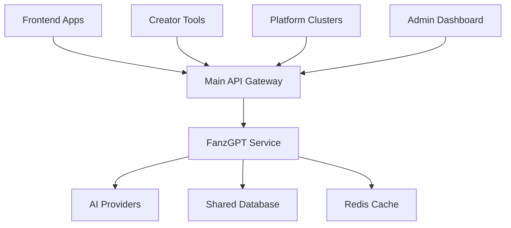

# 🔗 FanzGPT Ecosystem Integration Guide

**Seamlessly integrate FanzGPT AI Assistant with the FANZ Unified Ecosystem**

This guide provides comprehensive instructions for integrating FanzGPT with other FANZ services, establishing proper communication patterns, and maintaining ecosystem coherence.

---

## 🏗️ Architecture Overview

### **Service Positioning**
FanzGPT operates as a **specialized AI microservice** within the FANZ ecosystem, providing AI capabilities to:

- **Main API Server** (`fanz-api-dev:3000`)
- **Frontend Application** (`fanz-frontend-dev:3001`)
- **Mobile Application** (`fanz-mobile-dev:3002`)
- **Creator Dashboard** (`fanz-dash:3010`)
- **Platform Clusters** (BoyFanz, GirlFanz, etc.)

### **Communication Patterns**


---

## 🔌 Service-to-Service Integration

### **1. Main API Server Integration**

#### **Environment Configuration**
Add to main API server's `docker-compose.dev.yml`:

```yaml
environment:
  - FANZ_GPT_URL=http://fanz-gpt-dev:3100
  - FANZ_GPT_API_KEY=${FANZ_GPT_API_KEY}
```

#### **API Client Setup**
Create API client in main server:

```typescript
// services/FanzGPTClient.ts
import axios, { AxiosInstance } from 'axios';

export class FanzGPTClient {
  private client: AxiosInstance;

  constructor() {
    this.client = axios.create({
      baseURL: process.env.FANZ_GPT_URL || 'http://fanz-gpt-dev:3100',
      timeout: 30000,
      headers: {
        'Content-Type': 'application/json',
        'Authorization': `Bearer ${process.env.FANZ_GPT_API_KEY}`,
      },
    });

    this.setupInterceptors();
  }

  private setupInterceptors(): void {
    // Request interceptor
    this.client.interceptors.request.use(
      (config) => {
        config.headers['X-Request-ID'] = this.generateRequestId();
        return config;
      },
      (error) => Promise.reject(error)
    );

    // Response interceptor
    this.client.interceptors.response.use(
      (response) => response.data,
      (error) => {
        console.error('FanzGPT API Error:', error.response?.data || error.message);
        return Promise.reject(error);
      }
    );
  }

  // Content Generation Methods
  public async generateSocialPost(data: {
    userId: string;
    topic: string;
    platform: string;
    options?: any;
  }): Promise<{ post: string }> {
    return this.client.post('/api/v1/content/social-post', data);
  }

  public async generatePersonalizedMessage(data: {
    userId: string;
    recipientId: string;
    context: string;
    relationship: string;
  }): Promise<{ message: string }> {
    return this.client.post('/api/v1/content/personalized-message', data);
  }

  // Chat Methods
  public async generateChatResponse(data: {
    userId: string;
    message: string;
    history?: any[];
    options?: any;
  }): Promise<{ response: string }> {
    return this.client.post('/api/v1/chat/response', data);
  }

  // Creator Tools
  public async generateContentCalendar(data: {
    userId: string;
    timeframe: string;
    preferences: any;
  }): Promise<{ calendar: any }> {
    return this.client.post('/api/v1/creator/content-calendar', data);
  }

  // Health Check
  public async healthCheck(): Promise<any> {
    return this.client.get('/health');
  }

  private generateRequestId(): string {
    return `${Date.now()}-${Math.random().toString(36).substr(2, 9)}`;
  }
}

export default new FanzGPTClient();
```

### **2. Frontend Integration**

#### **API Service Setup**
```typescript
// services/api/fanzgpt.ts
import { apiClient } from './base';

export const fanzGPTApi = {
  // Content Generation
  generateSocialPost: async (data: {
    topic: string;
    platform: string;
    options?: any;
  }) => {
    return apiClient.post('/ai/content/social-post', data);
  },

  generatePersonalizedMessage: async (data: {
    recipientId: string;
    context: string;
    relationship: string;
  }) => {
    return apiClient.post('/ai/content/personalized-message', data);
  },

  // Chat Features
  getChatResponse: async (data: {
    message: string;
    history?: any[];
  }) => {
    return apiClient.post('/ai/chat/response', data);
  },

  getConversationStarters: async (data: {
    context?: string;
    count?: number;
  }) => {
    return apiClient.post('/ai/chat/starters', data);
  },

  // Creator Tools
  generateContentCalendar: async (data: {
    timeframe: string;
    preferences: any;
  }) => {
    return apiClient.post('/ai/creator/content-calendar', data);
  },

  analyzePerformance: async (data: {
    timeframe: string;
  }) => {
    return apiClient.post('/ai/creator/performance-analysis', data);
  },

  // Media Analysis
  analyzeImage: async (data: {
    imageUrl: string;
    analysisType: string;
  }) => {
    return apiClient.post('/ai/media/analyze-image', data);
  },

  // Voice Processing
  synthesizeVoice: async (data: {
    text: string;
    voice: string;
    options?: any;
  }) => {
    return apiClient.post('/ai/voice/synthesize', data);
  },
};
```

#### **React Hooks**
```typescript
// hooks/useFanzGPT.ts
import { useState, useCallback } from 'react';
import { fanzGPTApi } from '../services/api/fanzgpt';

export const useFanzGPT = () => {
  const [loading, setLoading] = useState(false);
  const [error, setError] = useState<string | null>(null);

  const generateContent = useCallback(async (
    type: string,
    data: any
  ) => {
    setLoading(true);
    setError(null);

    try {
      let result;
      switch (type) {
        case 'social-post':
          result = await fanzGPTApi.generateSocialPost(data);
          break;
        case 'personalized-message':
          result = await fanzGPTApi.generatePersonalizedMessage(data);
          break;
        case 'chat-response':
          result = await fanzGPTApi.getChatResponse(data);
          break;
        default:
          throw new Error('Unknown content type');
      }
      return result;
    } catch (err) {
      const errorMessage = err instanceof Error ? err.message : 'Unknown error';
      setError(errorMessage);
      throw err;
    } finally {
      setLoading(false);
    }
  }, []);

  return {
    loading,
    error,
    generateContent,
  };
};
```

### **3. Database Integration**

#### **Shared User Context**
```sql
-- Add FanzGPT integration fields to existing user table
ALTER TABLE users ADD COLUMN IF NOT EXISTS ai_preferences JSONB DEFAULT '{}';
ALTER TABLE users ADD COLUMN IF NOT EXISTS ai_usage_stats JSONB DEFAULT '{}';
ALTER TABLE users ADD COLUMN IF NOT EXISTS ai_personalization_data JSONB DEFAULT '{}';

-- Create AI generation history table
CREATE TABLE IF NOT EXISTS ai_generation_history (
    id UUID PRIMARY KEY DEFAULT gen_random_uuid(),
    user_id UUID NOT NULL REFERENCES users(id),
    generation_type VARCHAR(50) NOT NULL,
    input_data JSONB NOT NULL,
    output_data JSONB NOT NULL,
    metadata JSONB DEFAULT '{}',
    created_at TIMESTAMP WITH TIME ZONE DEFAULT NOW(),
    updated_at TIMESTAMP WITH TIME ZONE DEFAULT NOW()
);

-- Create AI analytics table
CREATE TABLE IF NOT EXISTS ai_analytics (
    id UUID PRIMARY KEY DEFAULT gen_random_uuid(),
    user_id UUID NOT NULL REFERENCES users(id),
    event_type VARCHAR(50) NOT NULL,
    event_data JSONB NOT NULL,
    timestamp TIMESTAMP WITH TIME ZONE DEFAULT NOW()
);

-- Create indexes for performance
CREATE INDEX IF NOT EXISTS idx_ai_generation_history_user_id ON ai_generation_history(user_id);
CREATE INDEX IF NOT EXISTS idx_ai_generation_history_type ON ai_generation_history(generation_type);
CREATE INDEX IF NOT EXISTS idx_ai_analytics_user_id ON ai_analytics(user_id);
CREATE INDEX IF NOT EXISTS idx_ai_analytics_event_type ON ai_analytics(event_type);
```

### **4. Authentication & Authorization**

#### **JWT Integration**
```typescript
// middleware/fanzgpt-auth.ts
import jwt from 'jsonwebtoken';
import { Request, Response, NextFunction } from 'express';

export interface FanzGPTAuthRequest extends Request {
  user?: {
    id: string;
    role: string;
    permissions: string[];
  };
}

export const fanzGPTAuthMiddleware = (
  req: FanzGPTAuthRequest,
  res: Response,
  next: NextFunction
) => {
  try {
    const token = req.headers.authorization?.replace('Bearer ', '');
    
    if (!token) {
      return res.status(401).json({
        error: 'Authentication required',
        message: 'No token provided',
      });
    }

    const decoded = jwt.verify(token, process.env.JWT_SECRET!) as any;
    req.user = {
      id: decoded.userId,
      role: decoded.role,
      permissions: decoded.permissions || [],
    };

    // Check AI feature permissions
    if (!req.user.permissions.includes('ai:use')) {
      return res.status(403).json({
        error: 'Insufficient permissions',
        message: 'AI features not enabled for this user',
      });
    }

    next();
  } catch (error) {
    return res.status(401).json({
      error: 'Invalid token',
      message: 'Authentication failed',
    });
  }
};
```

---

## 🔄 Event-Driven Integration

### **Event Bus Setup**
```typescript
// events/FanzGPTEventBus.ts
import EventEmitter from 'events';

export interface AIGenerationEvent {
  userId: string;
  type: string;
  input: any;
  output: any;
  metadata?: any;
}

export interface AIAnalyticsEvent {
  userId: string;
  event: string;
  data: any;
}

class FanzGPTEventBus extends EventEmitter {
  // Emit AI generation completed
  public emitGenerationCompleted(event: AIGenerationEvent): void {
    this.emit('ai:generation:completed', event);
  }

  // Emit AI analytics event
  public emitAnalyticsEvent(event: AIAnalyticsEvent): void {
    this.emit('ai:analytics:event', event);
  }

  // Emit user preference updated
  public emitPreferenceUpdated(userId: string, preferences: any): void {
    this.emit('ai:preferences:updated', { userId, preferences });
  }
}

export default new FanzGPTEventBus();
```

### **Event Handlers**
```typescript
// handlers/AIEventHandlers.ts
import FanzGPTEventBus from '../events/FanzGPTEventBus';
import { DatabaseService } from '../services/database';
import { NotificationService } from '../services/notifications';

// Handle AI generation completion
FanzGPTEventBus.on('ai:generation:completed', async (event) => {
  try {
    // Save to generation history
    await DatabaseService.query(`
      INSERT INTO ai_generation_history (user_id, generation_type, input_data, output_data, metadata)
      VALUES ($1, $2, $3, $4, $5)
    `, [event.userId, event.type, event.input, event.output, event.metadata]);

    // Update user AI usage stats
    await DatabaseService.query(`
      UPDATE users 
      SET ai_usage_stats = ai_usage_stats || jsonb_build_object(
        'total_generations', COALESCE((ai_usage_stats->>'total_generations')::int, 0) + 1,
        'last_generation', NOW()
      )
      WHERE id = $1
    `, [event.userId]);

    console.log(`AI generation completed for user ${event.userId}: ${event.type}`);
  } catch (error) {
    console.error('Error handling AI generation completion:', error);
  }
});

// Handle analytics events
FanzGPTEventBus.on('ai:analytics:event', async (event) => {
  try {
    await DatabaseService.query(`
      INSERT INTO ai_analytics (user_id, event_type, event_data)
      VALUES ($1, $2, $3)
    `, [event.userId, event.event, event.data]);
  } catch (error) {
    console.error('Error handling AI analytics event:', error);
  }
});
```

---

## 🔧 Configuration Management

### **Centralized Config**
```typescript
// config/ecosystem-config.ts
export interface EcosystemConfig {
  services: {
    fanzGPT: {
      url: string;
      apiKey: string;
      timeout: number;
      retries: number;
    };
    mainAPI: {
      url: string;
      version: string;
    };
    database: {
      url: string;
      poolSize: number;
    };
  };
  ai: {
    defaultProvider: string;
    maxTokens: number;
    temperature: number;
    rateLimits: {
      requestsPerMinute: number;
      tokensPerMinute: number;
    };
  };
  features: {
    contentGeneration: boolean;
    chatAssistance: boolean;
    imageAnalysis: boolean;
    voiceProcessing: boolean;
  };
}

export const ecosystemConfig: EcosystemConfig = {
  services: {
    fanzGPT: {
      url: process.env.FANZ_GPT_URL || 'http://fanz-gpt-dev:3100',
      apiKey: process.env.FANZ_GPT_API_KEY || '',
      timeout: parseInt(process.env.FANZ_GPT_TIMEOUT || '30000'),
      retries: parseInt(process.env.FANZ_GPT_RETRIES || '3'),
    },
    mainAPI: {
      url: process.env.MAIN_API_URL || 'http://fanz-api-dev:3000',
      version: 'v1',
    },
    database: {
      url: process.env.DATABASE_URL || '',
      poolSize: parseInt(process.env.DB_POOL_SIZE || '10'),
    },
  },
  ai: {
    defaultProvider: process.env.AI_DEFAULT_PROVIDER || 'openai',
    maxTokens: parseInt(process.env.AI_MAX_TOKENS || '4000'),
    temperature: parseFloat(process.env.AI_TEMPERATURE || '0.7'),
    rateLimits: {
      requestsPerMinute: parseInt(process.env.AI_RATE_LIMIT_RPM || '50'),
      tokensPerMinute: parseInt(process.env.AI_RATE_LIMIT_TPM || '50000'),
    },
  },
  features: {
    contentGeneration: process.env.FEATURE_CONTENT_GENERATION === 'true',
    chatAssistance: process.env.FEATURE_CHAT_ASSISTANCE === 'true',
    imageAnalysis: process.env.FEATURE_IMAGE_ANALYSIS === 'true',
    voiceProcessing: process.env.FEATURE_VOICE_PROCESSING === 'true',
  },
};
```

---

## 📊 Monitoring & Observability

### **Health Check Integration**
```typescript
// monitoring/health-checks.ts
import { FanzGPTClient } from '../services/FanzGPTClient';

export const healthChecks = {
  async fanzGPT(): Promise<{ status: string; details?: any }> {
    try {
      const health = await FanzGPTClient.healthCheck();
      return { status: 'healthy', details: health };
    } catch (error) {
      return { 
        status: 'unhealthy', 
        details: { error: error.message } 
      };
    }
  },

  async database(): Promise<{ status: string; details?: any }> {
    // Database health check implementation
  },

  async redis(): Promise<{ status: string; details?: any }> {
    // Redis health check implementation  
  },
};
```

### **Metrics Collection**
```typescript
// monitoring/metrics.ts
import client from 'prom-client';

// AI generation metrics
export const aiGenerationCounter = new client.Counter({
  name: 'fanzgpt_generations_total',
  help: 'Total number of AI generations',
  labelNames: ['user_id', 'type', 'status'],
});

export const aiGenerationDuration = new client.Histogram({
  name: 'fanzgpt_generation_duration_seconds',
  help: 'Duration of AI generation requests',
  labelNames: ['type'],
  buckets: [0.1, 0.5, 1, 2, 5, 10, 30],
});

export const aiTokenUsage = new client.Counter({
  name: 'fanzgpt_tokens_used_total',
  help: 'Total number of AI tokens used',
  labelNames: ['provider', 'model'],
});
```

---

## 🔒 Security Integration

### **API Security**
```typescript
// security/api-security.ts
export const securityMiddleware = {
  // Rate limiting per user
  userRateLimit: rateLimit({
    windowMs: 15 * 60 * 1000, // 15 minutes
    max: (req) => {
      const user = req.user as any;
      return user?.subscription === 'premium' ? 200 : 100;
    },
    keyGenerator: (req) => (req.user as any)?.id || req.ip,
  }),

  // Content filtering
  contentFilter: (req: Request, res: Response, next: NextFunction) => {
    const content = req.body.text || req.body.message || '';
    
    // Basic content filtering
    const blockedTerms = process.env.BLOCKED_TERMS?.split(',') || [];
    const hasBlockedContent = blockedTerms.some(term => 
      content.toLowerCase().includes(term.toLowerCase())
    );

    if (hasBlockedContent) {
      return res.status(400).json({
        error: 'Content violation',
        message: 'Content contains blocked terms',
      });
    }

    next();
  },
};
```

---

## 🚀 Deployment Integration

### **Docker Orchestration**
The FanzGPT service is already integrated into the main `docker-compose.dev.yml` file. For production:

```yaml
# docker-compose.production.yml additions
services:
  fanz-gpt-prod:
    build:
      context: ./services/fanz-gpt
      dockerfile: Dockerfile.prod
    environment:
      - NODE_ENV=production
      - PORT=3100
      - DATABASE_URL=${DATABASE_URL}
      - REDIS_URL=${REDIS_URL}
      - OPENAI_API_KEY=${OPENAI_API_KEY}
      - ANTHROPIC_API_KEY=${ANTHROPIC_API_KEY}
    deploy:
      replicas: 3
      resources:
        limits:
          cpus: '2'
          memory: 2G
        reservations:
          cpus: '1'
          memory: 1G
```

### **Load Balancing**
```nginx
# nginx/fanzgpt-upstream.conf
upstream fanzgpt_backend {
    least_conn;
    server fanz-gpt-prod-1:3100;
    server fanz-gpt-prod-2:3100;
    server fanz-gpt-prod-3:3100;
}

location /api/ai/ {
    proxy_pass http://fanzgpt_backend/api/v1/;
    proxy_set_header Host $host;
    proxy_set_header X-Real-IP $remote_addr;
    proxy_set_header X-Forwarded-For $proxy_add_x_forwarded_for;
    proxy_connect_timeout 30s;
    proxy_send_timeout 30s;
    proxy_read_timeout 30s;
}
```

---

## 🧪 Testing Integration

### **Integration Tests**
```typescript
// tests/integration/fanzgpt-integration.test.ts
import { FanzGPTClient } from '../../services/FanzGPTClient';
import { setupTestDatabase, teardownTestDatabase } from '../helpers/database';

describe('FanzGPT Integration', () => {
  beforeAll(async () => {
    await setupTestDatabase();
  });

  afterAll(async () => {
    await teardownTestDatabase();
  });

  describe('Content Generation', () => {
    it('should generate social media posts', async () => {
      const result = await FanzGPTClient.generateSocialPost({
        userId: 'test-user-1',
        topic: 'morning workout',
        platform: 'instagram',
      });

      expect(result).toHaveProperty('post');
      expect(typeof result.post).toBe('string');
      expect(result.post.length).toBeGreaterThan(10);
    });
  });

  describe('Health Checks', () => {
    it('should return healthy status', async () => {
      const health = await FanzGPTClient.healthCheck();
      
      expect(health.status).toBe('healthy');
      expect(health).toHaveProperty('services');
    });
  });
});
```

---

## 📈 Performance Optimization

### **Caching Strategy**
```typescript
// caching/ai-cache.ts
import Redis from 'ioredis';

export class AICacheService {
  private redis: Redis;

  constructor() {
    this.redis = new Redis(process.env.REDIS_URL);
  }

  // Cache AI responses with content-based keys
  public async cacheGeneration(
    userId: string,
    type: string,
    inputHash: string,
    result: any,
    ttl: number = 3600
  ): Promise<void> {
    const key = `ai:${type}:${userId}:${inputHash}`;
    await this.redis.setex(key, ttl, JSON.stringify(result));
  }

  public async getCachedGeneration(
    userId: string,
    type: string,
    inputHash: string
  ): Promise<any | null> {
    const key = `ai:${type}:${userId}:${inputHash}`;
    const cached = await this.redis.get(key);
    return cached ? JSON.parse(cached) : null;
  }
}
```

---

## 🎯 Best Practices

### **1. Error Handling**
- Implement circuit breakers for AI provider failures
- Graceful degradation when AI services are unavailable
- Comprehensive error logging and alerting

### **2. Performance**
- Cache frequently generated content
- Use connection pooling for database operations  
- Implement request queuing for high-load scenarios

### **3. Security**
- Validate all input data before processing
- Implement proper rate limiting per user/subscription tier
- Encrypt sensitive data in transit and at rest

### **4. Monitoring**
- Track AI usage costs and token consumption
- Monitor response times and success rates
- Set up alerts for service health and performance

### **5. Scalability**
- Design for horizontal scaling with load balancers
- Use message queues for async processing
- Implement proper database indexing

---

## 🔄 Next Steps

1. **Complete Integration Testing** - Test all service interactions
2. **Performance Benchmarking** - Measure response times and throughput
3. **Security Audit** - Review authentication and data protection
4. **Documentation Updates** - Update API documentation
5. **Production Deployment** - Deploy to staging and production environments

This integration guide ensures FanzGPT operates seamlessly within the FANZ ecosystem while maintaining high performance, security, and scalability standards.